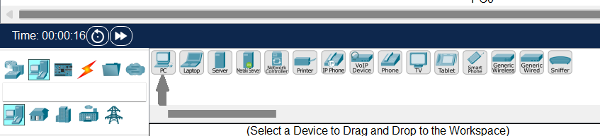
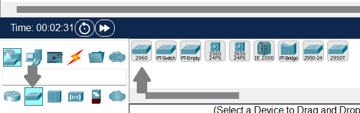
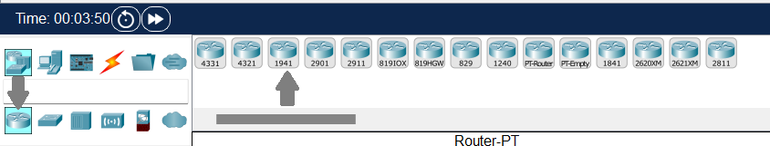
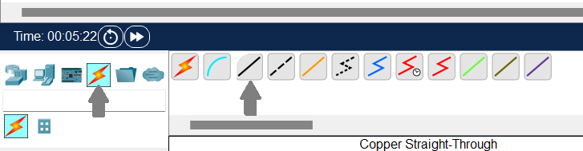
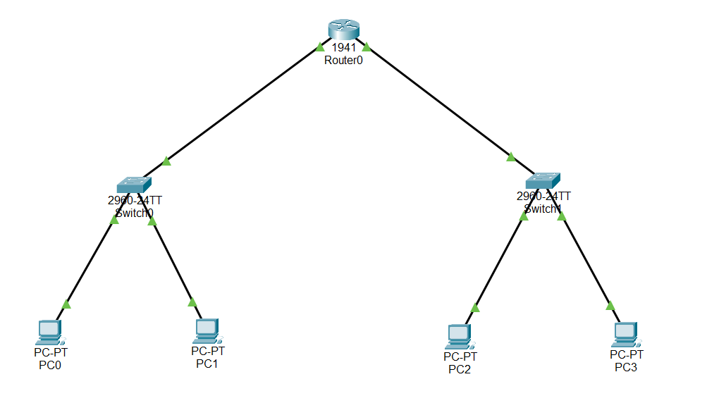
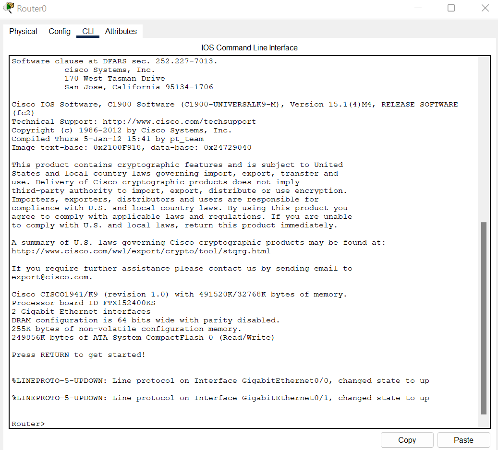
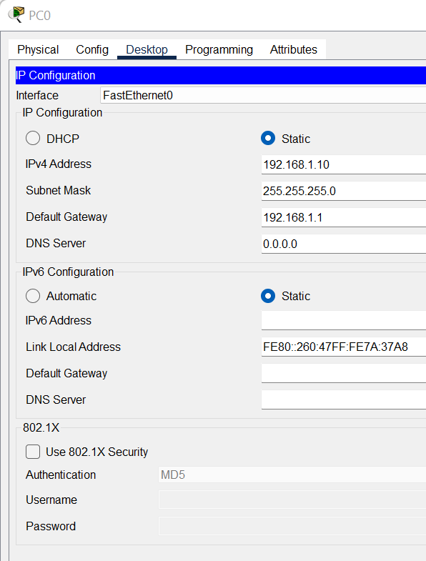
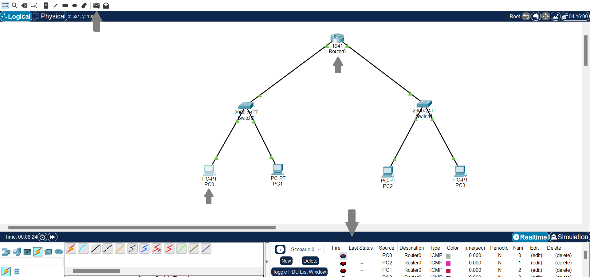

# Lab 01 – Inter LAN Routing

##  Objective

To connect two separate LANs using a router and allow communication between them. 

## Requirements

- 4 PC 
- 2 Switches
- 1 Router

# Setup

- First we will select two PCs, for that we will go on the bottom left corner and click on the second option (End Devices) from here we will select our desired PCs and place them on the workspace.

- Now click on the first option in the first row and second option from the second row called **switch** . Here, from the right side select the very first switch.

- Beside the switch we have option of **Routers** , from that select the 1941 .

- To connect all these components we would need cables so we will select the following options to get a copper straight through cable .

Now to connect these wires you can take the help of the following table as, this is how I connected them.

## LAN 1 – Connections

| From Device | From Port        | To Device | To Port            |
|-------------|------------------|-----------|---------------------|
| PC0         | FastEthernet0    | Switch1   | FastEthernet0/1     |
| PC1         | FastEthernet0    | Switch1   | FastEthernet0/2     |
| Switch1     | GigabitEthernet0/1 | Router    | GigabitEthernet0/0  |

## LAN 2 – Connections

| From Device | From Port        | To Device | To Port            |
|-------------|------------------|-----------|---------------------|
| PC2         | FastEthernet0    | Switch2   | FastEthernet0/1     |
| PC3         | FastEthernet0    | Switch2   | FastEthernet0/2     |
| Switch2     | GigabitEthernet0/0 | Router    | GigabitEthernet0/1  |

Here is how it would look at the end
 

## Configuration 

Next step is to configure the router and all PCs.We will start with the router.

### Router

- Click on the router , then from there click on CLI tab at the top of that window it will open following interface.

- This is where we will enter the following commands step by step.

  `Router> enable`

- The above command will allow access to configuration commands

  `Router# configure terminal`

- Using this we enter global configuration mode to allow making changes to the device.

  `Router(config)# interface gig0/0`
 
- Accesses the configuration mode for the GigabitEthernet0/0 interface.

  `Router(config-if)# ip address 192.168.1.1 255.255.255.0`

- Assigns an IP address and subnet mask to the selected interface.Here I chose this one you can select any private ip address.

  `Router(config-if)# no shutdown`

- Enables (brings up) the interface, which is administratively down by default.

  `Router(config-if)# exit`

- Exits the interface configuration mode and returns to global config mode.

Now we will repeat the same commands for the other interface just make sure to change the network ip address and interface name 

`Router(config)# interface gig0/1`

`Router(config-if)# ip address 192.168.2.1 255.255.255.0`

`Router(config-if)# no shutdown`

`Router(config-if)# exit`

`Router(config)# wr`

The above command used at the end saves our router configurations so that if we open this file in the future we won't have to reconfigure.

### PCs

Click on the PC then from the top click on desktop . When we will click on IP configuration there we will get following interface.

of course you won't see these adresses first as this is how it will look after I configured it.

First we will switch the mode to static so we can provide **IPv4 Address** , **Subnet Mask** and **Default Gateway** ourselves.

Now for each PC add the subnet mask used when configuring router interface. First ip address of that network will be used as default gateway(we can use any other but this is best practice) Now we will assign a random ip to the PC . Following chart shows what are the things I applied to my network.

| PC Name | IP Address     | Subnet Mask       | Default Gateway |
|---------|----------------|-------------------|------------------|
| PC0     | 192.168.1.10   | 255.255.255.0     | 192.168.1.1      |
| PC1     | 192.168.1.11   | 255.255.255.0     | 192.168.1.1      |
| PC2     | 192.168.2.10   | 255.255.255.0     | 192.168.2.1      |
| PC3     | 192.168.2.11   | 255.255.255.0     | 192.168.2.1      |

# Testing

After the orangle lights on the wires turn green that means connections are established . Now it's time for testing.

You can see a small envelope on the top in the lower bar click on it .
Now click on any PC whom you want that it send a data packet after that click on the one that will recieve that packet .

If the logs in the bottom right show **successful** then congratulations! your network is now working.

